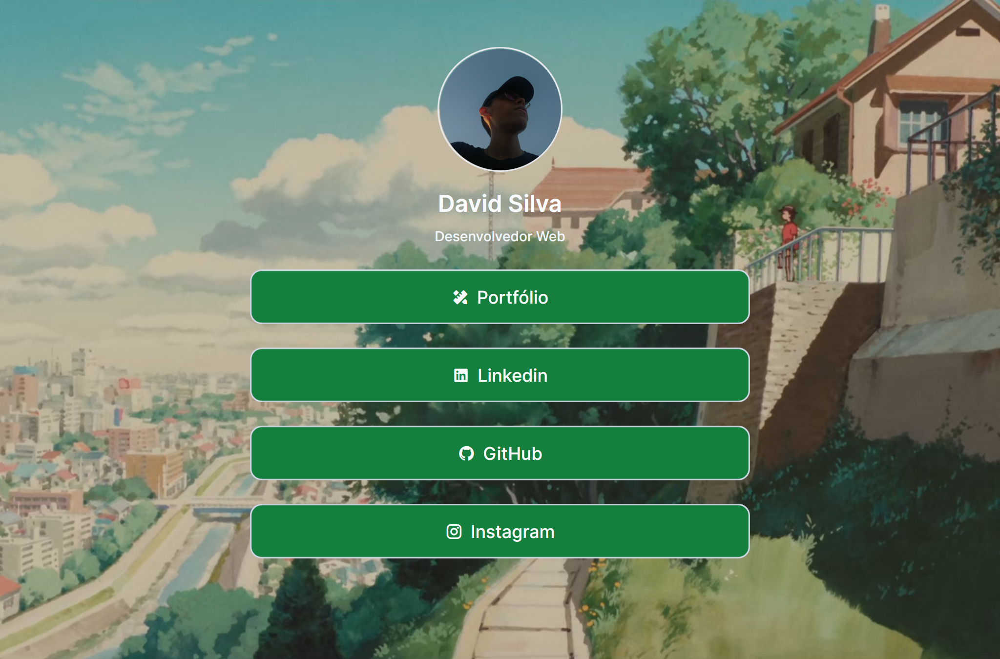
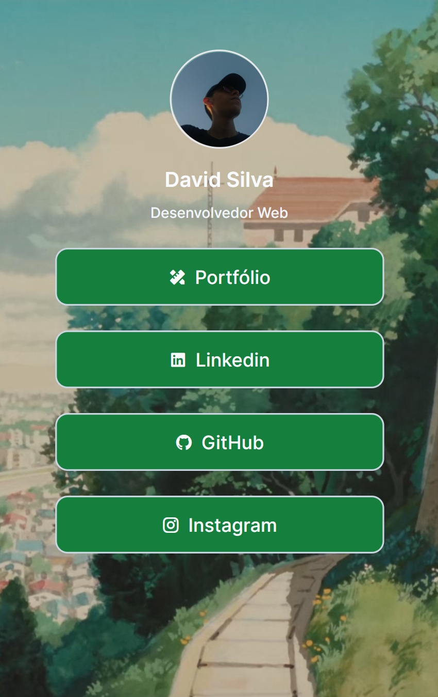

# Link Pack
## :leaves: **Projeto**

O Link Pack é um projeto criado baseado na [Linktree](https://linktr.ee), cujo objetivo é o mesmo, ao agregar os links das minhas redes sociais e portfólio.

## :link: **Link**
*[Link do projeto.](https://link-pack.vercel.app)* - *[Post do Instagram](https://www.instagram.com/p/Ck4bb6Hpr-L/?utm_source=ig_web_copy_link)*

## :art: **Visual do Projeto**
### *Desktop e Telas Maiores*
<h1 align="center">
    
</h1>

### *Mobile e Telas Menores*
<h1 align="center">
    
</h1>

## :wrench: **Tecnologias**
Tecnologias utilizadas no projeto.
* HTML;
* CSS;
* [Tailwind CSS](https://tailwindcss.com/docs/customizing-colors);
* JavaScript;
* [Vue.js](https://vuejs.org);
* [Node e NPM](https://nodejs.org/en/);
* [Vite](https://vitejs.dev);
* Visual Studio Code;
* [Remixicon](https://remixicon.com);
* Google Fonts.

## :rocket: **Configurações e Instalação**

Veja [documentação de configuração do Vite](https://vitejs.dev/config/).


### **Clonando o Projeto**

```sh
git clone https://github.com/davsilvam/link-pack.git
```

### **Executando o Projeto**

```sh
npm install
```

### **Compilar e abrir o programa para desenvolvimento**

```sh
npm run dev
```

### **Compilar e reduzir para produção**

```sh
npm run build
```

## :memo: **Licença**

Esse projeto está sob a licença MIT.

<p align="center">
  
</p>

<p align="center">
  Feito com :purple_heart: por <a href="https://www.linkedin.com/in/davsilvam/">David Silva</a>.
</p>

---
